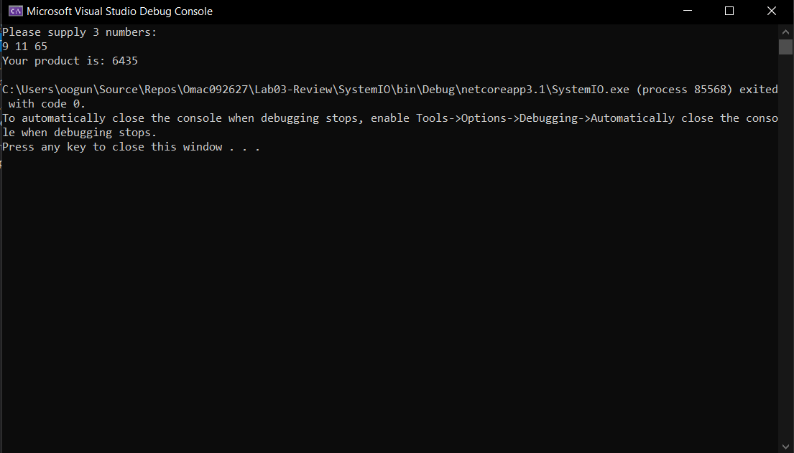
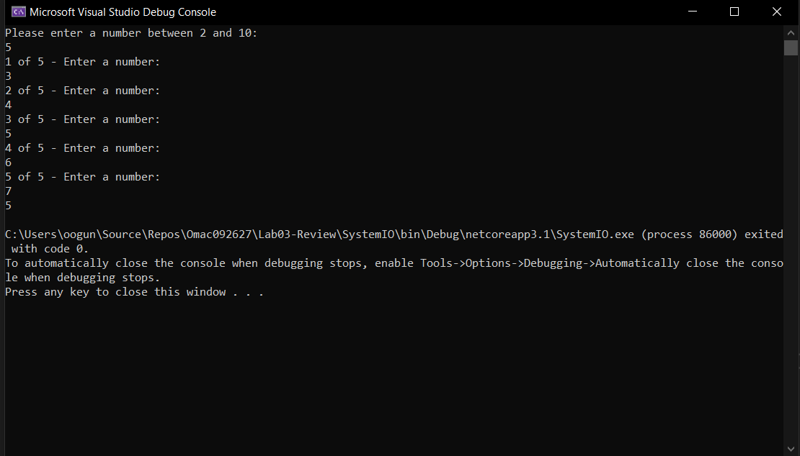
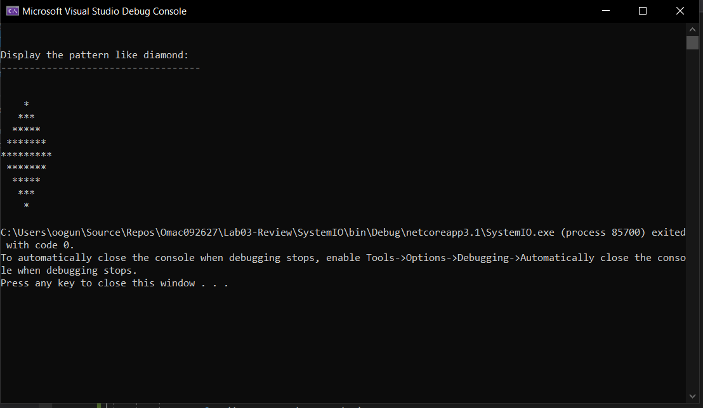
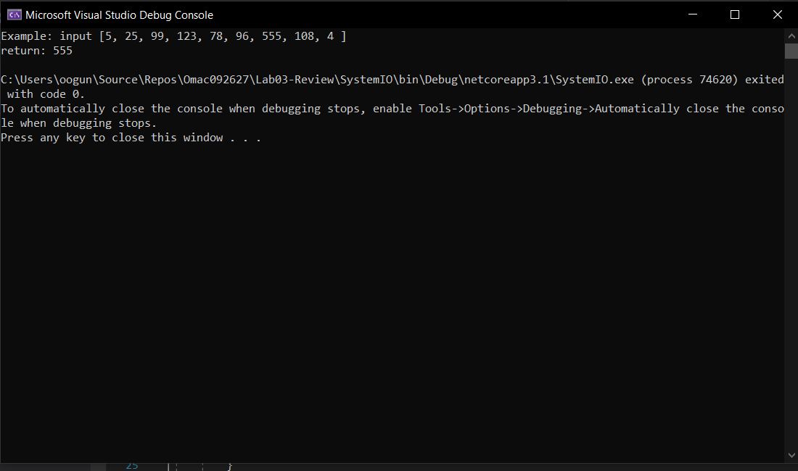
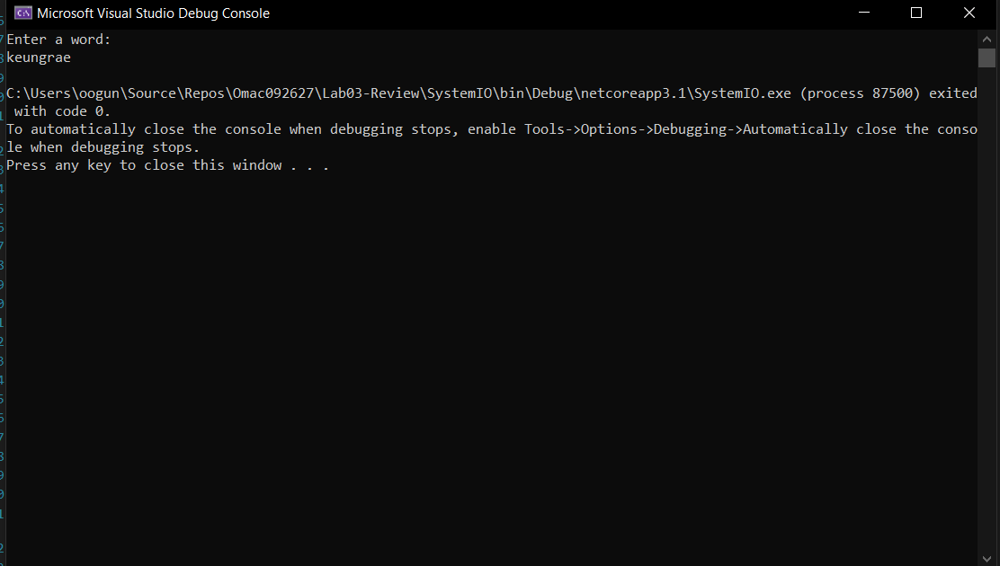
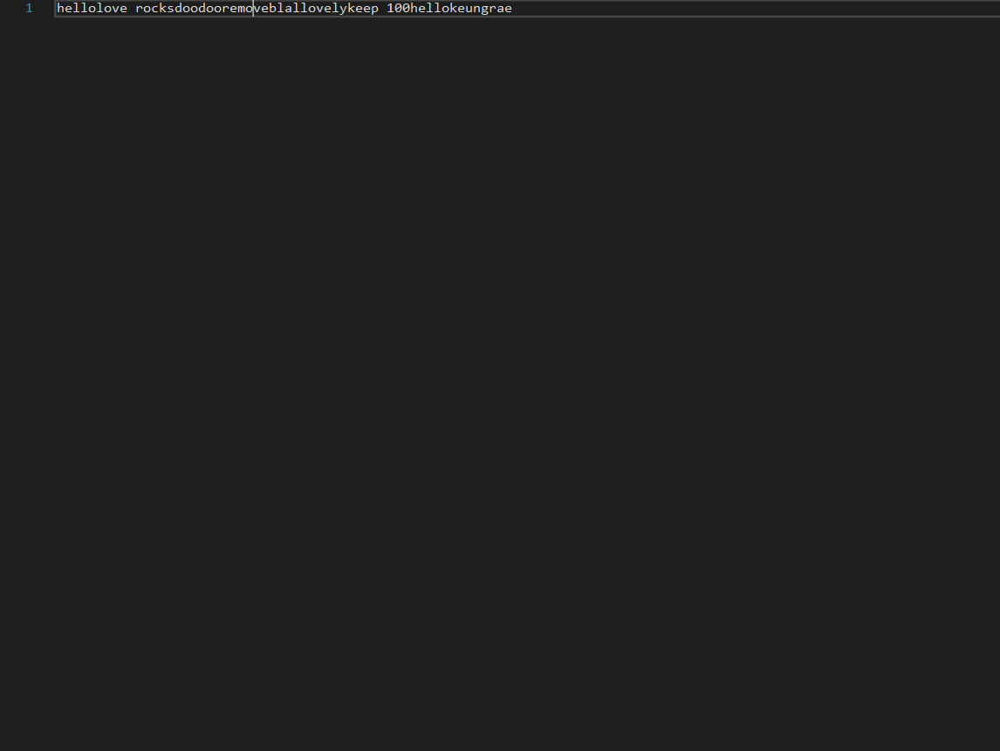
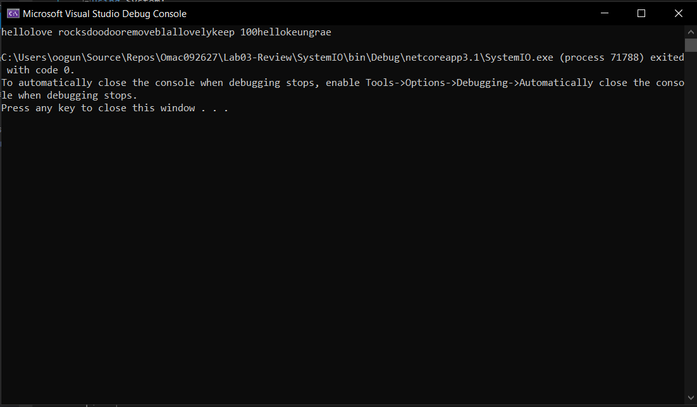
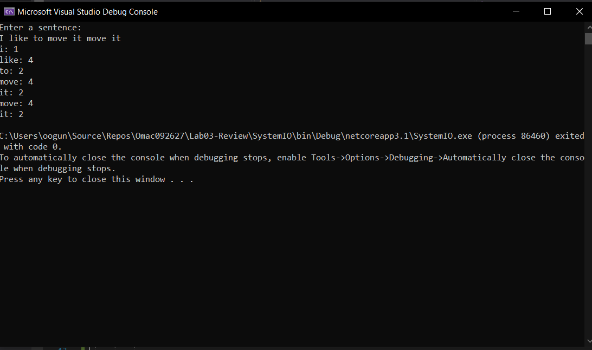

#SYSTEM I/O CONSOLE APPLICATION - WITH UNIT TESTING

Author: 

Lami Beach

Program Specifications:

---

Problem Domain
Create a single Console Application Project within Visual Studio. Write all of your code in the Program.cs file. with a method for each of the challenge below. Call each of these methods in your main method.

Be sure to use exception handling where appropriate, and write tests as outlined in each of the challenges.

Whiteboard at least one of the challenges and include it in your readme. If you are working in groups, every person in the group must have their own whiteboard for a different problem.

---

# Challenge 1
Write a program that asks the user for 3 numbers. Return the product of these 3 numbers multiplied together. If the user puts in less than 3 numbers, return 0; If the user puts in more than 3 numbers, only multiply the first 3. If the number is not a number, default that value to 1.

 

---

# Challenge 2

I prompt the user and ask them to enter a number between 2 and 10. 
I read that information and run a try parse in order to test my conversion.
If everything runs smoothly, it prompts the user that number of times.
After the user has entered the numbers, it takes the sum and provides the average.

---

# Challenge 3
Create a method that will output to the console the following design. Pay attention to spacing.

Tests:

No tests are required

The first for loop is calculating the spaces while the second one is incrementing
The same follows suit to print the bottom half

---

# Challenge 4
Write a method that brings in an integer array and returns the number that appears the most times. 
If there are no duplicates, return the first number in the array. 
If more than one number show up the same amount of time, return the first found.

Calculate the average of the inputted integers.
Return the frequency of integers.
Check if the numbers duplicate or not
Return first number if no duplicates

---

# Challenge 5

I declare an int to hold my array and put some variable in to mitigate workload.
I prompt the user to enter the amount of numbers they want in array.
After I propmt the user the number of times they entered.
I loop through the users input to find the max value.

---

#Challenge 6

Write a method that asks the user to input a word, and then saves that word into an external file named words.txt

---

#Challenge 7
Write a method that reads the file in from Challenge 6, and outputs the contents to the console.

Stretch: 1. Tests are optional for this challenge

 Reading and writing the file back to the console

---

#Challenge 8
Write a method that reads in the file from Challenge 6. Removes one of the words, and rewrites it back to the file.

First i instantiate the reading of the file
Then split the words to separate what I want to remove
Followed by a for loop to loop through my words
If my words are there from previous, delte them
Followed by joining my new words

---

#Challenge 9
Write a method that asks the user to input a sentence and returns an array that with the word and the number of characters each word has:

---

© Lami Beach 2020

