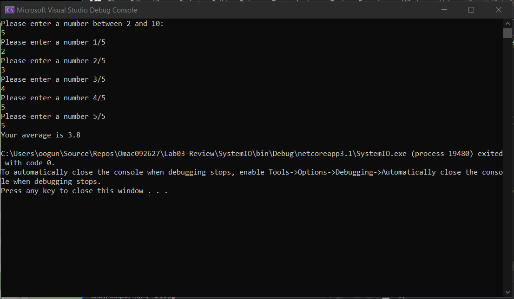

#SYSTEM I/O CONSOLE APPLICATION - WITH UNIT TESTING

Author: 

Lami Beach

Program Specifications:

Problem Domain
Create a single Console Application Project within Visual Studio. Write all of your code in the Program.cs file. with a method for each of the challenge below. Call each of these methods in your main method.

Be sure to use exception handling where appropriate, and write tests as outlined in each of the challenges.

Whiteboard at least one of the challenges and include it in your readme. If you are working in groups, every person in the group must have their own whiteboard for a different problem.

Challenge 1
Write a program that asks the user for 3 numbers. Return the product of these 3 numbers multiplied together. If the user puts in less than 3 numbers, return 0; If the user puts in more than 3 numbers, only multiply the first 3. If the number is not a number, default that value to 1.

Example

Please enter 3 numbers - 4 8 15
The product of these 3 numbers is: 480
Hint: Consider using the split method

Tests

Input a string of numbers and it returns a product of all numbers
Input more than 3 numbers
Input of less than 3 numbers
Can it handle negative numbers

Summary

       
       Pt 1:
        /// 

        /// A main method that calls my weak methods
        /// We start by Calling it, with parenthesis
        /// 

        Pt 2:
        /// 

        /// The StartItUp() method begins by asking the user to enter 3 numbers
        /// Followed by stringifying the users input and converting to string
        /// Then I call my canReturnInputNumber() method with the parameter of pickSomething, the submitted
        /// code that's been converted to string.
        /// 

        Pt 3:
        /// 

        /// I call the canReturnInputNumber in order to perform the logic needed to perform what I'm asking.
        /// 1.I start by stringifying the input and combinging with a Split(). 
        ///     - This allows the input to be split with delimetters.
        /// 2. The assignment then calls for to first allow an array of 3 numbers to be inputted
        ///     - The if statement tests whether the length is less than 3
        /// 3. Then I need to declare a new int array and an int in order to store and multiply
        ///     - I follow up with a for loop, hard coded, that loops through 3 numbers.
        ///     - I then follow with an if statement that also converts a string to an integer and returns a value
        ///         - It's called TryParse() and it's sick
        ///     - Finally, I multiply the product x 1 in order to return the value.
        ///         - The one is so I get the value of the array back
        ///     - Lastly, I call the writeLine method in order to display what the user entered back to them
        ///         - followed by returning the product.
        /// 

 

Challenge 2
Create a method that asks the user to enter a number between 2-10. Then, prompt the user that number of times for random numbers.

After the user has inputted all of the numbers. Find the average of all the numbers inputted.

Specs: 1. Do not let the user put in negative numbers 2. Confirm each input is a real number

Example:

Please enter a number between 2-10: 4

1 of 4 - Enter a number: 4
2 of 4 - Enter a number: 8
3 of 4 - Enter a number: 15
4 of 4 - Enter a number: 16
The average of these 4 numbers is: 10

Tests:

Input different ranges of numbers and confirm averages
Confirm input
All numbers are 0s

        /// 

        /// I prompt the user and ask them to enter a number between 2 and 10. 
        /// I read that information and run a try parse in order to test my conversion.
        /// If everything runs smoothly, it prompts the user that number of times.
        /// After the user has entered the numbers, it takes the sum and provides the average.
        /// 

Challenge 3
Create a method that will output to the console the following design. Pay attention to spacing.

    * 
   *** 
  *****
 *******
*********
 *******
  *****
   ***
    * 

Tests:

No tests are required

        /// 

        /// This challenge was tricky. I start by propmpting the user to enter the number of rows which act as half
        /// of the diamond.
        /// I then convert the users input followed by activating a forloop. The loop runs through the users 
        /// entered input, which is 8. The first for loop is calculating the spaces while the second one is incrementing
        /// "*" symbol and building up to 8 rows. 
        /// The following for loop below it does the same thing.
        /// 

Challenge 4
Write a method that brings in an integer array and returns the number that appears the most times. If there are no duplicates, return the first number in the array. If more than one number show up the same amount of time, return the first found.

 Example: Input: [1,1,2,2,3,3,3,1,1,5,5,6,7,8,2,1,1]
 output: 1
Tests:

Input different size arrays
All numbers in the array are the same value
No duplicates exist in the array
There multiple numbers that show up the same amount of times.

Challenge 5
Write a method in that finds the maximum value in the array. The array is not sorted. You may not use .Sort()

Example: input [5, 25, 99, 123, 78, 96, 555, 108, 4]

return: 555
Tests: 1. Negative numbers 2. All values are the same

Challenge 6
Write a method that asks the user to input a word, and then saves that word into an external file named words.txt

Hint: Have a file already saved in the root of your directory with a couple of words already present in the file.

Stretch: 1. Tests are optional for this challenge

Challenge 7
Write a method that reads the file in from Challenge 6, and outputs the contents to the console.

Stretch: 1. Tests are optional for this challenge

Challenge 8
Write a method that reads in the file from Challenge 6. Removes one of the words, and rewrites it back to the file.

Stretch: 1. Tests are optional for this challenge

Challenge 9
Write a method that asks the user to input a sentence and returns an array that with the word and the number of characters each word has:

Example: input: "This is a sentance about important things"
Output: ["this: 4","is: 2", "a: 1", "sentance: 8", "about: 5", "important: 9", "things: 6"]
Tests: 1. Input a sentance, and it returns the correct array 2. Inut a sentance and confirm it returns an array 3. Use different sentances with differnt symbols

© Code Fellows 2020

Resources: 

